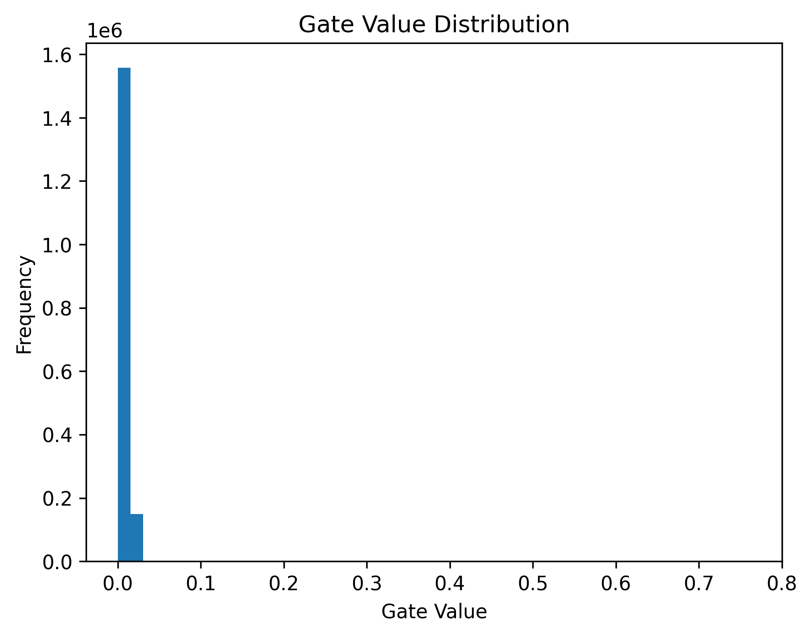

# Self-Pruning Neural Network

A PyTorch implementation of a neural network that **learns to prune its own weights during training** using learnable gates and L1 sparsity regularization.

  Key Idea

Each weight is paired with a gate:
pruned_weight = weight × sigmoid(gate_score)

* Gates close → weights effectively removed
* L1 penalty on gates → encourages sparsity

---

Results

| Lambda | Accuracy | Sparsity |
| ------ | -------- | -------- |
| 1e-5   | 50.32%   | 39.35%   |
| 1e-4   | 48.49%   | 50.28%   |
| 1e-3   | 45.03%   | 58.28%   |
| 1e-2   | 34.60%   | 59.92%   |

---

 Gate Distribution

---

Insights

* Increasing λ increases sparsity but reduces accuracy
* Model prunes connections during training (no post-processing needed)
* Clear trade-off between efficiency and performance

---

 Tech Stack

* Python
* PyTorch
* Matplotlib

---

Conclusion

The model successfully demonstrates **dynamic pruning during training**, producing a more efficient network by removing less important connections automatically.

---

Future Work

* Extend to CNN architectures
* Experiment with stronger sparsity constraints
* Optimize for higher accuracy

---
